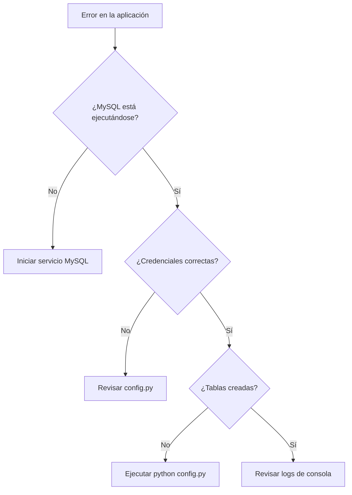

# 🚀 Pastor Noticias "Q Pasa" - Portal de Noticias

<div align="center">


**Sistema moderno de gestión y visualización de noticias**

</div>

## 📋 Tabla de Contenidos

- [🚀 Características](#-características)
- [⚡ Instalación Rápida](#-instalación-rápida)
- [🔧 Configuración Detallada](#-configuración-detallada)
- [🐛 Solución de Problemas](#-solución-de-problemas)
- [📁 Estructura del Proyecto](#-estructura-del-proyecto)
- [👤 Usuarios y Roles](#-usuarios-y-roles)
- [🎯 Comandos Rápidos](#-comandos-rápidos)

## 🚀 Características

✨ **Interfaz moderna** con Streamlit  
🔐 **Sistema de autenticación** seguro  
📰 **Gestión completa** de noticias  
❤️ **Sistema de favoritos** personalizado  
🔍 **Búsqueda avanzada** y filtros  
📊 **Dashboard administrativo**  
📱 **Diseño responsive**  
🎨 **Interfaz intuitiva** y amigable  

## ⚡ Instalación Rápida

### Prerrequisitos
- ✅ Python 3.8 o superior
- ✅ MySQL 8.0+ o MariaDB
- ✅ Git

### 🛠️ Instalación en 3 Pasos

```bash
# 1. Clonar y entrar al directorio
git clone <tu-repositorio>
cd PortalNoticia

# 2. Crear y activar entorno virtual
python -m venv venv
.\venv\Scripts\Activate.ps1

# 3. Instalar dependencias y configurar
pip install -r requirements.txt
python config.py

# 4. Ejecutar la aplicación
streamlit run app.py
```

## 🔧 Configuración Detallada

### ⚠️ Paso 0: Entorno Virtual Dañado

Si encuentras este error:
```bash
Fatal error in launcher: Unable to create process...
```

**Solución:**
```powershell
deactivate
rmdir venv -Recurse -Force
python -m venv venv
.\venv\Scripts\Activate.ps1
pip install -r requirements.txt
```

### 📥 Paso 1: Instalar Dependencias

```powershell
# Activar entorno virtual
.\venv\Scripts\Activate.ps1

# Instalar dependencias
pip install -r requirements.txt

# Instalar conector MySQL si es necesario
pip install mysql-connector-python
```

### 🗄️ Paso 2: Configurar Base de Datos

**Archivo `config.py` - Configuración por defecto:**
```python
HOST = "127.0.0.1"
PORT = 3306
USER = "root"
PASSWORD = ""  # Cambiar si tu MySQL tiene contraseña
DATABASE = "pastor_noticias_db"
```

**Crear base de datos y tablas:**
```bash
python config.py
```

✅ **Esto creará:**
- Base de datos `pastor_noticias_db`
- Todas las tablas necesarias
- Usuario administrador por defecto

### 👑 Paso 3: Usuario Administrador

**Credenciales por defecto:**
```
👤 Usuario: admin
🔑 Contraseña: admin123
📧 Email: admin@pastornoticias.com
🎯 Rol: admin
```

> ⚠️ **IMPORTANTE:** Cambia la contraseña después del primer inicio de sesión.

### 🚀 Paso 4: Ejecutar la Aplicación

**Opción 1 - Comando directo:**
```bash
streamlit run app.py
```

**Opción 2 - Script batch:**
```bash
.\start_pastor_noticias.bat
```

### 🌐 Paso 5: Acceder a la Aplicación

Abre tu navegador en:
```
http://localhost:8501
```

Inicia sesión con las credenciales de administrador.

## 🐛 Solución de Problemas

### ❌ Error: Módulo no encontrado
```bash
ModuleNotFoundError: No module named 'mysql.connector'
```
**Solución:**
```bash
pip install mysql-connector-python
```

### ❌ Error: Conexión a MySQL
```bash
Can't connect to MySQL server
```
**Soluciones:**
```powershell
# Verificar servicio MySQL
net start MySQL

# O en Windows: Servicios → "MySQL"
```

### ❌ Error: Acceso denegado
```bash
Access denied for user 'root'@'localhost'
```
**Verificar en `config.py`:**
```python
USER = "root"
PASSWORD = ""  # Cambiar si es necesario
```

### ❌ Error: Creación de tablas
**Ejecutar manualmente:**
```sql
CREATE DATABASE IF NOT EXISTS pastor_noticias_db 
CHARACTER SET utf8mb4 COLLATE utf8mb4_unicode_ci;
```

Luego:
```bash
python config.py
```

### ❌ Error: Login no funciona
**Recrear tablas:**
```bash
python -c "from config import DatabaseConfig; DatabaseConfig.setup_tables()"
```

**Verificar usuario en MySQL:**
```sql
USE pastor_noticias_db;
SELECT * FROM usuarios;
```

## 📁 Estructura del Proyecto

```
PortalNoticia/
├── 🎯 app.py                    # Aplicación principal
├── ⚙️ config.py                 # Configuración de BD
├── 📊 db/
│   ├── __init__.py
│   ├── 🔐 auth.py               # Autenticación
│   └── 🗄️ mysql_io.py           # Operaciones MySQL
├── 🧩 components/
│   ├── __init__.py
│   ├── 🔑 login.py
│   ├── 🃏 cards.py
│   ├── 🔍 search.py
│   └── 🔔 notifications.py
├── 👁️ views/
│   ├── 📄 detail.py
│   ├── ❤️ favorites.py
│   └── 📈 dashboard.py
├── 📋 requirements.txt
└── 🚀 start_pastor_noticias.bat
```

## 👤 Usuarios y Roles

### 🔧 Administrador (`admin`)
- Gestionar todas las noticias
- Crear y eliminar usuarios
- Acceso completo al sistema
- Configuración del portal

### 👥 Usuario Registrado (`user`)
- Ver noticias completas
- Guardar favoritos
- Personalizar preferencias
- Comentar (si está implementado)

### 👤 Usuario Básico (`guest`)
- Ver noticias públicas
- Navegación limitada

## 🎯 Comandos Rápidos

```bash
# 🔄 Reset completo
deactivate && rmdir venv -Recurse -Force && python -m venv venv && .\venv\Scripts\Activate.ps1

# 📦 Instalar todo
pip install -r requirements.txt && pip install mysql-connector-python

# 🗄️ Configurar BD
python config.py

# 🚀 Ejecutar
streamlit run app.py

# ✅ Verificar instalación
python -c "from db.auth import autenticar_usuario; u,e=autenticar_usuario('admin','admin123'); print('✅ Login OK' if u else f'❌ Error: {e}')"
```

## 🔍 Verificación Final

Después de la instalación, ejecuta:

```bash
python -c "from db.auth import autenticar_usuario; u,e=autenticar_usuario('admin','admin123'); print('✅ Login OK' if u else f'❌ Error: {e}')"
```

**Salida esperada:** `✅ Login OK`

## 📞 Soporte Técnico

### 🆘 Si algo falla:

1. **Verifica que MySQL esté activo**
2. **Revisa config.py** - credenciales correctas
3. **Mira la consola** - mensajes de error detallados
4. **Verifica dependencias** - `pip list`

### 🔄 Flujo de solución de problemas:



---

<div align="center">

**¿Necesitas ayuda adicional?**  
📧 **Contacto:** alexander.sandoval150fd@gmail.com 
🐛 **Reportar issues:** [GitHub Issues]()

---

**¡Listo para comenzar! 🎉**  
*El portal de noticias más moderno y eficiente*

</div>

